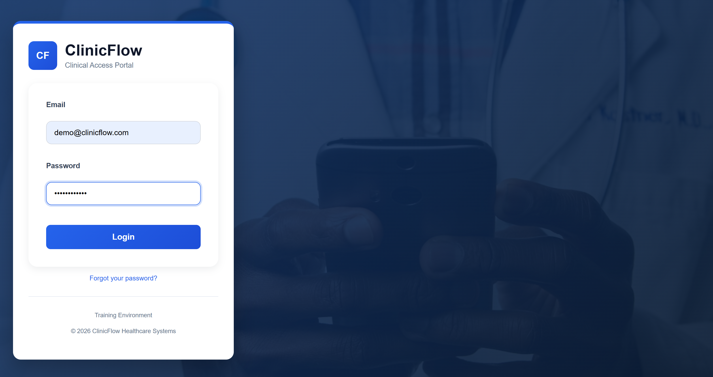
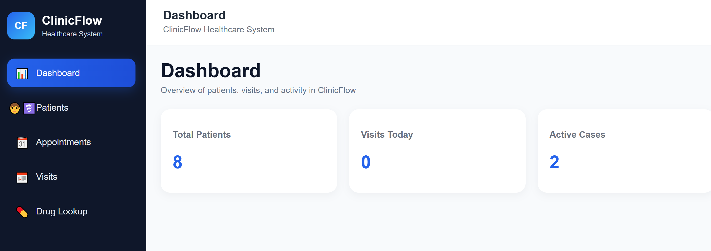
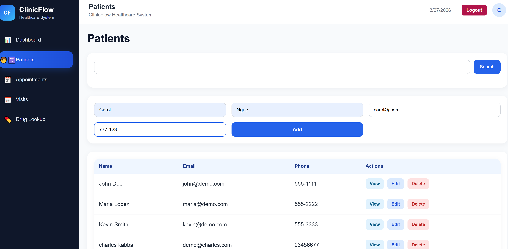
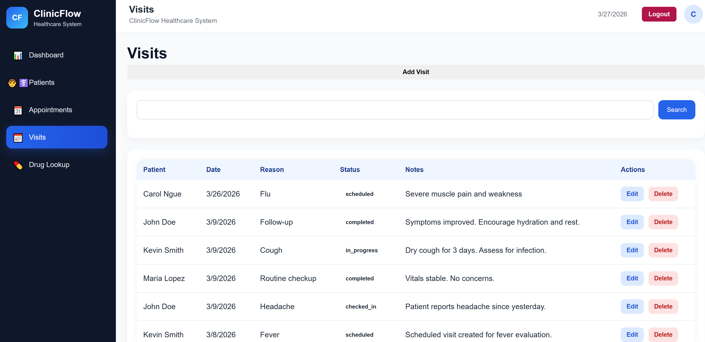
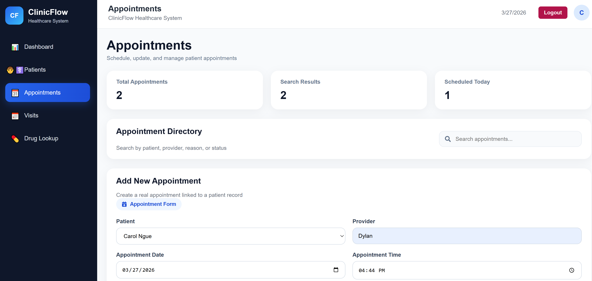
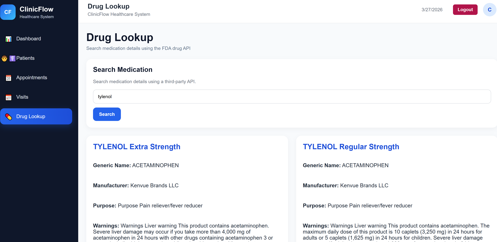

# 🏥 ClinicFlow

A full-stack healthcare workflow management application designed to streamline patient tracking, visit documentation, and appointment scheduling.

Built with real clinical experience as a Patient Care Technician, ClinicFlow focuses on improving efficiency, accuracy, and usability in healthcare environments.

---

## 🌐 Live Demo

🚀 https://your-live-app-link.com

---

## 🔗 Project Repositories

- 💻 Frontend: https://github.com/mbafousu/ClinicFlow-Frontend.git
- ⚙️ Backend:  https://github.com/mbafousu/ClinicFlow-Backend.git

---

## 📌 Overview

ClinicFlow simulates a real-world clinic system where healthcare staff can:

- Manage patient records  
- Track visits and vitals  
- Schedule and manage appointments  
- Access drug information via a third-party API  
- Securely authenticate users  

---

## 🚀 Features

- ✅ Patient Management (Full CRUD)  
- ✅ Visit Tracking (Full CRUD)  
- ✅ Appointment Scheduling & Management  
- ✅ JWT Authentication (secure login & protected routes)  
- ✅ Drug Lookup (FDA API integration)  
- ✅ Search & filtering (patients & visits)  
- ✅ RESTful API integration  

---

## 🖥️ Screenshots

### Login

### Dashboard

### Patients

### Visits

### Appointments

### Drug Lookup
